<div align="center">
<h1> Eliza: AI Agent Orchestration
</h1>
</div>

</br>

<div align="center">
  <a href="https://www.eliza-agent.yaps.gg">
    
  </a>
</div>

</br>

<div align="left">
<h2> Introducing Wei – The Enterprise-Grade AI Agent For Personal Growth. Wei is part of the Eliza Agent Orchestration with advanced memory, real-time search, and comprehensive analytics.
</h2>
</div>

<br>

<p align="left">
  

🌱 **Wei** is your enterprise-grade conversational AI agent that transforms habit-building through natural dialogue, persistent memory, and real-time intelligence. Powered by **Keywords AI** (250+ models), **Mem0** memory system, and **Tavily** search - Wei provides personalized, contextual, and evidence-based wellness coaching with complete observability and analytics.

</p>

<div align="center">
  <a href="https://github.com/Anora-Labs/eliza-agent-orchestration/blob/main/ARCHITECTURE.md">
    
  </a>
  <a href="https://github.com/Anora-Labs/eliza-agent-orchestration/blob/main/KEYWORDS_AI_INTEGRATION.md">
    
  </a>
  <a href="https://github.com/Anora-Labs/eliza-agent-orchestration/blob/main/MEM0_INTEGRATION.md">
    
  </a>
  <a href="https://github.com/Anora-Labs/eliza-agent-orchestration/blob/main/TAVILY_SEARCH_INTEGRATION.md">
    
  </a>
</div>

Twit us! https://x.com/abdibrokhim/status/1937049784776585483

<br>

<div align="center">
    
  </a>
</div>

<br>

## ✨ Enterprise Features

### 🧠 **Advanced AI Infrastructure**
- **Keywords AI Gateway**: Access to 250+ models (GPT-4o, Claude, Gemini, Llama) with load balancing
- **Mem0 Memory System**: Persistent conversation memory with vector embeddings
- **Tavily Search**: Real-time web search and current events integration
- **Multi-Model Intelligence**: Dynamic model selection for optimal performance

### 🤖 **Expert AI Agents**
- **General Agent**: Primary wellness assistant with full feature access
- **Habit Coach**: Evidence-based coaching with scientific research retrieval
- **User Data Agent**: Profile management and data insights
- **Points Calculator**: Dynamic rewards with streak-based bonuses
- **Rewards Manager**: Intelligent reward recommendations
- **Greeter Agent**: Personalized welcome experiences

### 📊 **Enterprise Analytics & Monitoring**
- **Real-time Performance Tracking**: API response times, success rates, costs
- **User Behavior Analytics**: Engagement patterns, habit completion rates
- **LLM Usage Monitoring**: Token usage, model performance, cost optimization
- **Custom Event Tracking**: Memory operations, search analytics, agent interactions

### 🔍 **Real-time Intelligence**
- **Live Web Search**: Current health/wellness information and research
- **News Integration**: Latest developments in wellness and personal growth
- **Quick Answers**: Fast factual responses for habit-related questions
- **Evidence-based Coaching**: Scientific research backing for recommendations

### 🧠 **Memory & Personalization**
- **Conversation Memory**: Persistent context across sessions
- **User Preference Learning**: Adaptive responses based on past interactions
- **Context-aware Responses**: Relevant memory retrieval for personalized coaching
- **Cross-session Continuity**: Seamless experience across devices and sessions

### 🔒 **Enterprise Security**
- **Row Level Security (RLS)**: User-isolated data access
- **JWT Authentication**: Secure token-based authentication
- **CSRF Protection**: Request validation and security
- **Rate Limiting**: Per-user API limits and abuse protection


<table>
  <tr>
    <td></td>
    <td></td>
  </tr>
  <tr>
    <td></td>
    <td></td>
  </tr>
</table>


<br>

## 📺 Demo Video

### Introducing Eliza: AI Agent Orchestration

[](https://youtu.be/0M3YRPWCssw)

<br>

## 🚀 Architecture Overview

Wei AI Assistant features a sophisticated multi-layer architecture:

```mermaid
graph TB
    User[👤 User] --> UI[🎨 Next.js App]
    UI --> API[🌐 API Layer]
    API --> KeywordsAI[🧠 Keywords AI<br/>250+ Models]
    KeywordsAI --> Agents[🤖 AI Agents]
    Agents --> Functions[🛠️ Functions & Tools]
    Functions --> Storage[💾 Multi-Database<br/>Supabase + IndexedDB + Mem0]
    
    API --> Mem0[🧠 Mem0 Memory]
    API --> Tavily[🔍 Tavily Search]
    KeywordsAI --> Analytics[📊 Analytics & Monitoring]
```



### 🏗️ **Core Components:**
- **Frontend**: Next.js with real-time voice interface (WebRTC)
- **AI Gateway**: Keywords AI with 250+ model access
- **Memory**: Mem0 with vector embeddings and Supabase storage
- **Search**: Tavily for real-time web search capabilities
- **Database**: Multi-layer with Supabase (primary) and IndexedDB (local)
- **Analytics**: Comprehensive monitoring and user behavior tracking

## 🔧 **Environment Setup**

### Required API Keys:
```bash
# Core AI Infrastructure
KEYWORDS_AI_API_KEY=your_keywords_ai_api_key
OPENAI_API_KEY=your_openai_api_key  # Fallback
TAVILY_API_KEY=your_tavily_api_key

# Database & Storage
NEXT_PUBLIC_SUPABASE_URL=your_supabase_url
NEXT_PUBLIC_SUPABASE_ANON_KEY=your_supabase_anon_key
SUPABASE_SERVICE_ROLE=your_supabase_service_role_key
```

## ⚙️ Quick Start

> **🚀 Complete Setup Guide**: Check out the [INSTALLATION.md](./INSTALLATION.md) for a step-by-step guide on how to get started with Eliza Agent Orchestration.
> 
> **☁️ Deploy Now**: Deploy your own Eliza Agent Orchestration now! Check out the [DEPLOY.md](./DEPLOY.md).
>
> **📖 Architecture Deep Dive**: For detailed architecture documentation, see [ARCHITECTURE.md](./ARCHITECTURE.md).

### Integration Documentation:
- [Keywords AI Integration](./KEYWORDS_AI_INTEGRATION.md) - LLM gateway and analytics setup
- [Mem0 Memory Integration](./MEM0_INTEGRATION.md) - Persistent memory system setup
- [Tavily Search Integration](./TAVILY_SEARCH_INTEGRATION.md) - Real-time search capabilities
- [Integration Summary](./INTEGRATION_SUMMARY.md) - Complete overview of all integrations

## 📊 **What Makes Wei Enterprise-Grade?**

### 🚀 **Performance & Scalability**
- **Multi-Model Load Balancing**: Automatic failover and optimal model selection
- **Real-time Analytics**: Sub-second response monitoring and cost optimization
- **Auto-scaling Infrastructure**: Handles enterprise-level traffic with Supabase and managed services
- **Offline-first Architecture**: Works without internet with IndexedDB local storage

### 🧠 **Advanced AI Capabilities**
- **Persistent Memory**: Conversations remembered across sessions with vector search
- **Contextual Intelligence**: Agents learn from past interactions for personalized responses
- **Real-time Knowledge**: Live web search ensures current, accurate information
- **Evidence-based Coaching**: Scientific research backing for all wellness recommendations

### 📈 **Business Intelligence**
- **User Behavior Analytics**: Detailed insights into engagement and habit formation
- **Cost Monitoring**: Real-time LLM usage and cost tracking with optimization
- **Performance Metrics**: API response times, success rates, and system health
- **Custom Event Tracking**: Track any business metric important to your organization

### 🔐 **Enterprise Security**
- **Zero-trust Architecture**: User-isolated data with row-level security
- **Audit Logging**: Complete audit trail of all user interactions and system events
- **Data Privacy**: GDPR-compliant with user data isolation and deletion capabilities
- **API Security**: Rate limiting, CSRF protection, and secure authentication

## 🏢 **Use Cases**

### 🏥 **Healthcare & Wellness Organizations**
- Patient habit tracking with evidence-based recommendations
- Personalized wellness coaching with memory of patient preferences
- Real-time health research integration for up-to-date treatment protocols

### 🏢 **Corporate Wellness Programs**
- Employee wellness tracking with privacy-first design
- Team habit challenges with analytics and reporting
- Integration with existing HR and wellness platforms

### 🎓 **Educational Institutions**
- Student habit formation and academic performance correlation
- Personalized study habit coaching with research-backed strategies
- Long-term student development tracking and analytics

### 💼 **Coaching & Consulting Businesses**
- Client progress tracking with persistent memory across sessions
- Evidence-based coaching recommendations with real-time research
- Detailed analytics and reporting for client outcomes

## 🥂 Contributing to Eliza Agent Orchestration

> We greatly appreciate your interest in contributing to our enterprise-grade open-source initiative. To ensure a smooth collaboration and the success of contributions, we adhere to a set of contributing guidelines similar to those established by Open Community. For a comprehensive understanding of the steps involved in contributing to our project, please refer to the Eliza Agent Orchestration [CONTRIBUTING.md](./CONTRIBUTING.md). 🤝🚀
>
> An essential part of contributing involves not only submitting new features with accompanying tests (and, ideally, examples) but also ensuring that these contributions pass our automated pytest suite. This approach helps us maintain the project's quality and reliability by verifying compatibility and functionality.

### Contributors ✨

<a href="https://github.com/Anora-Labs/eliza-agent-orchestration/graphs/contributors">
  
</a>


## 📬 Community & Contact

If you're keen on exploring new research opportunities or discoveries with our platform and wish to dive deeper or suggest new features, we're here to talk. Feel free to get in touch for more details at abdibrokhim@gmail.com.

<br>

## 📝 License

The source code is licensed under Apache 2.0.
