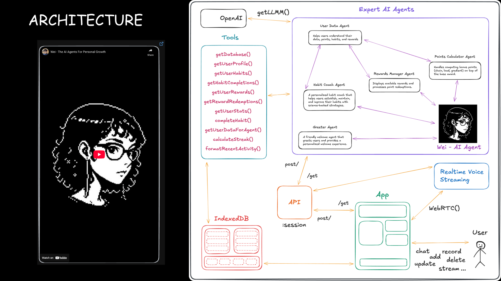

<h1> Eliza: AI Agent Orchestration
</h1>

 

  

 

<h2> Introducing Wei – The AI Agents For Personal Growth. Wei is part of the Eliza Agent Orchestration. Wei focuses on your personal growth and wellness.
</h2>

 

  

🌱 Wei is your conversational AI agent that makes habit-building effortless through natural dialogue. Speak with Wei, earn points for consistency, and transform daily routines into rewarding experiences—all with a playful personality that keeps you motivated on your wellness journey.

Twit us! https://x.com/abdibrokhim/status/1937049784776585483

 

    
  </a>

 

## ✨ Key Features

<table>
  <tr>
    <td></td>
    <td></td>
  </tr>
  <tr>
    <td></td>
    <td></td>
  </tr>
</table>

 

## 📺 Demo Video

### Introducing Eliza: AI Agent Orchestration

 

## ⚙️ Quick Start

> Check out the [INSTALLATION.md](./INSTALLATION.md) for a step-by-step guide on how to get started with Eliza Agent Orchestration.
> Deploy your own Eliza Agent Orchestration now! Check out the [DEPLOY.md](./DEPLOY.md).

## 🥂 Contributing to Eliza Agent Orchestration

> We greatly appreciate your interest in contributing to our open-source initiative. To ensure a smooth collaboration and the success of contributions, we adhere to a set of contributing guidelines similar to those established by Open Community. For a comprehensive understanding of the steps involved in contributing to our project, please refer to the Eliza Agent Orchestration [CONTRIBUTING.md](./CONTRIBUTING.md). 🤝🚀
>
> An essential part of contributing involves not only submitting new features with accompanying tests (and, ideally, examples) but also ensuring that these contributions pass our automated pytest suite. This approach helps us maintain the project's quality and reliability by verifying compatibility and functionality.

### Contributors ✨

## 📬 Community & Contact

If you're keen on exploring new research opportunities or discoveries with our platform and wish to dive deeper or suggest new features, we're here to talk. Feel free to get in touch for more details at abdibrokhim@gmail.com.

 

## 📝 License

The source code is licensed under Apache 2.0.
